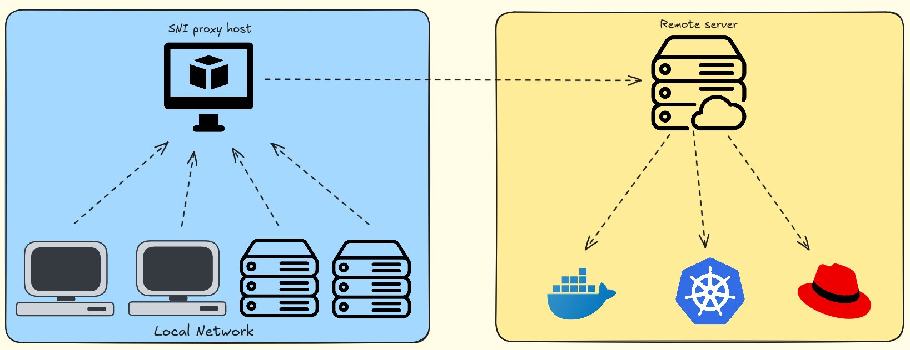

# SNI Proxy


#### A simple tool to bypass geographic sanctions

#### As simple as setting up your DNS settings!




### Tutorial Video

##### [SNI Proxy simply explained + deployment - PeerTube](https://tubedu.org/w/eXsUWTDJH4Rjb649GMsZZF)

##### [SNI Proxy simply explained + deployment - YouTube](https://youtu.be/PrF_25lWM1U)


### Requirements:

- **A Linux system with docker installed**
- **A V2Ray connection**


### Steps to build the service:

- Clone the project

  ```shell
  git clone https://github.com/shervinamd/sni-proxy.git
  ```

- Create a `.env` file and populate it with values corresponding to those in the `docker-compose.yml` file; you can use the `.env.example` file as a reference.

- Build the images

  ```shell
  docker compose build
  ```

- Create a suitable network for the project

  ```shell
  docker network create \
    --driver=bridge \
    --subnet=192.168.25.0/24 \
    --ip-range=192.168.25.0/24 \
    --gateway=192.168.25.254 \
    sninet
  ```

  **Note**:  The network name should be match with the one used in `docker-compose.yml`

- The `dnsmasq.conf` file contains restricted services need to access, feel free to add more if needed

- After the build process is completed, start the service.

  ```shell
  docker compose up -d
  ```


### Environment Variables

There are some environment variables required for the containers to work properly.

`SNI_HOST_IP` The IP address of the Docker host machine, which acts as a proxy for your network clients.

`DNS_PROXY_CONTAINER_IP` The IP address that is considered for the DNSProxy container.

`SNI_CONTAINER_IP` The IP address that is considered for the SNI container.

`V2RAY_CONTAINER_IP` The IP address that is considered for the V2Ray container.

`SOCKS_SERVICE_PORT` The port of the V2Ray service that listens for SOCKS5 connections.


## License
This project Licensed under [MIT License](LICENSE)


Made with ❤️ for the community
