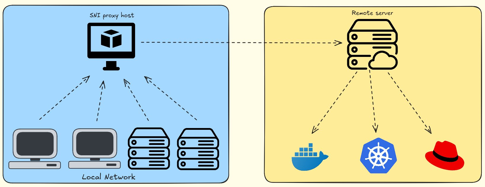

[](https://github.com/shervinamd/sni-proxy/actions/workflows/build-images.yml)

# SNI Proxy


A simple tool for accessing services restricted by geographic sanctions.

As simple as changing your DNS settings.




> [!TIP]
> **Tutorial Videos**
>
> [SNI Proxy simply explained + deployment - PeerTube](https://tubedu.org/w/eXsUWTDJH4Rjb649GMsZZF)
>
> [SNI Proxy simply explained + deployment - YouTube](https://youtu.be/PrF_25lWM1U)


## Requirements:

- **A Linux system with docker installed**
- **A Xray connection (will use as the SOCKS5 proxy)**


## Installation:

### 1. Clone the project

  ```shell
  git clone https://github.com/shervinamd/sni-proxy.git
  cd sni-proxy
  ```

- Create `.env` file and populate it with values corresponding to those in the `docker-compose.yml` file; you can use the `.env.example` file as a reference.
> [!NOTE]  
> If you are unsure how to create the file, use the following command:
> ```shell
> sed "s/SNI_HOST_IP=/SNI_HOST_IP=$(hostname -I | awk '{print $1}')/;" .env.example > .env
> ```
>
> Review the generated .env file and adjust any values that do not match your environment.

### 2. Pull the images first (optional)

  ```shell
  docker compose pull
  ```

### 3. Create the external Docker network required by the project:

  ```shell
  docker network create \
    --driver=bridge \
    --subnet=192.168.25.0/24 \
    --ip-range=192.168.25.0/24 \
    --gateway=192.168.25.254 \
    sninet
  ```
> [!IMPORTANT]
> The container IP addresses are used only for communication between containers on the Docker network. They are not LAN addresses and should not be assigned to your physical network interfaces.
>
> However, Docker adds routes for container subnets to the host's routing table. Make sure that the subnet used by this project does not overlap with your LAN, VPN, or any other existing network. If necessary, change the subnet, IP range, gateway, and container IP addresses in both the Docker network configuration and `docker-compose.yml`.


> [!NOTE]
> The network name should be match with the one used in `docker-compose.yml`
>
> ```yaml
> services:
>   dnsproxy:
>   # ...
>   networks:
>     NETWORK_NAME:
>       ipv4_address: ...
>   # ...
>   # Apply the same network configuration to the other services.
>   
> networks:
>   NETWORK_NAME:
>     external: true
> ```
> Replace `NETWORK_NAME` with the value used in your configuration defined in the `.env` file.

- The `dnsmasq.conf` file contains the services that should be accessed through the proxy. Add additional services if needed.
> [!NOTE]
> To add mode services, follow this pattern:
> `address=/RESTRICTED_SERVICE/{SNI_HOST_IP}`
> for example: `address=/k8s.io/{SNI_HOST_IP}`

### 4. After the build process is completed, start the service.

  ```shell
  docker compose up -d
  ```


### Environment Variables

There are some environment variables required for the containers to work properly.

- `SNI_IMAGE_NAME` The image name of the SNI Proxy service. (defined in `.env` file)

- `SNI_IMAGE_VERSION` The image tag of the SNI Proxy service.

- `DNSPROXY_IMAGE_NAME` The image name of the DNS Proxy service. (defined in `.env` file)

- `DNSPROXY_IMAGE_VERSION` The image tag of the DNS Proxy service.

- `XRAY_IMAGE_NAME` The image name of the Xray service. (defined in `.env` file)

- `XRAY_IMAGE_VERSION` The image tag of the Xray service.

- `SNI_HOST_IP` The IP address of the Docker host. Network clients use this address as their DNS server.

- `DNS_PROXY_CONTAINER_IP` The IP address assigned to the DNS Proxy container.

- `SNI_CONTAINER_IP` The IP address assigned to the SNI Proxy container.

- `XRAY_CONTAINER_IP` The IP address assigned to the Xray container.

- `SOCKS_SERVICE_PORT` The port on which the Xray service listens for SOCKS5 connections.

### Host and Container IP Addresses

`SNI_HOST_IP` and `SNI_CONTAINER_IP` serve different purposes:

| Variable | Description | Example |
| --- | --- | --- |
| `SNI_HOST_IP` | The Docker host's IP address on your LAN. Clients use this address as their DNS server. | `192.168.1.10` |
| `SNI_CONTAINER_IP` | The internal IP address of the SNI Proxy container on the Docker network. | `192.168.25.10` |

> [!WARNING]
> Do not use the same IP address for `SNI_HOST_IP` and `SNI_CONTAINER_IP`. The host IP belongs to your LAN, while the container IP belongs to the private Docker network.


> [!TIP]
> By default, images will pull from the DockerHub, so if you have any problem to pull images from DockerHub, use GHCR hosted images by commenting the DockerHub version of the image and uncomment the GHCR ones in the `.env` file:
> - `ghcr.io/shervinamd/sni-proxy/sni-proxy`  
> - `ghcr.io/shervinamd/sni-proxy/dnsproxy`  
> - `ghcr.io/shervinamd/sni-proxy/xray`  


## License
This project Licensed under [MIT License](LICENSE)


Made with ❤️ for the community
